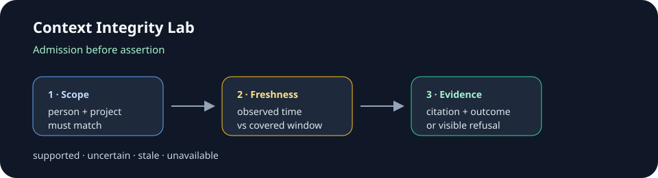

# Context Integrity Lab



**Status:** independent public release candidate.

Context Integrity Lab is a small deterministic demonstration of how an AI
assistant can refuse to answer from the wrong person, stale context, unavailable
sources, or fresh but irrelevant evidence. It is intentionally useful without
an API key or model account.

This is an independent portfolio project. It uses fictional records only and
has no model calls, network connection, credentials, employer code, meeting
transcripts, or customer data.

## What it demonstrates

- Exact person and project scope before retrieval.
- Observation time separated from the source's covered time window.
- Freshness checks with a visible stale disposition.
- Structured citations containing source and provenance window.
- Explicit `supported`, `uncertain`, `stale`, and `unavailable` outcomes.
- A reconciliation view that keeps duplicate and ambiguous identities visible.
- Deterministic behavior that can be tested without an external service.

## Fresh-clone install

```bash
git clone https://github.com/jonah-ux/context-integrity-lab.git
cd context-integrity-lab
python3 -m venv .venv
. .venv/bin/activate
python -m pip install -e .
```

The package has no runtime dependencies and supports Python 3.10 through the
versions exercised by CI. Installation is local-only; it does not contact a
provider or upload fixture data.

## Usage

Run the CLI against the included synthetic records:

```bash
context-integrity fixtures/records.json "Who owns the API?" \
  --person person-a --project project-a --now 2026-10-01T12:00:00Z
```

The command prints one JSON result to stdout. A supported answer exits `0`.
Expected refusal states such as a missing scope or stale evidence exit `1` so
callers cannot mistake a refusal for an answer. Invalid command input uses the
standard argparse usage exit. The result includes the status, reason, answer,
and citations when the admission boundary supports the response.

Try the scope refusal without changing the fixture:

```bash
context-integrity fixtures/records.json "Who owns the API?" \
  --person person-c --project project-a --now 2026-10-01T12:00:00Z
```

The included [reviewer walkthrough](DEMO.md) covers supported, scope, and
freshness cases and explains what each result does and does not prove.

## Browser console

```bash
context-integrity-demo --port 8765
```

Open `http://127.0.0.1:8765`. The local console exposes two inspectable flows:

1. **Record reconciliation:** classifies new people, matched applications,
   replayed source records, and ambiguous identity holds from a synthetic
   intake batch.
2. **Context admission:** evaluates a question against scoped, time-bounded
   context and displays the structured answer or refusal state with citations.

The browser console keeps state in memory and uses no external service or
credential.

## Development and agent use

Run the focused checks from a fresh checkout:

```bash
python -m py_compile context_integrity.py web_app.py
python -m unittest discover -s tests -v
git diff --check
```

See [CONTRIBUTING.md](CONTRIBUTING.md) for the review loop and
[AGENTS.md](AGENTS.md) for the safe machine-readable workflow. Changes should
keep the admission decision deterministic, preserve synthetic-only fixtures,
and make refusal states visible.

## Release and security

- [RELEASES.md](RELEASES.md) defines the version, asset, checksum, and rollback
  procedure.
- [SECURITY.md](SECURITY.md) explains how to report a suspected vulnerability
  without posting sensitive details publicly.
- [CHANGELOG.md](CHANGELOG.md) records user-facing changes.

## Portfolio boundary

This project is evidence of implementation and design judgment. It does not
prove a live meeting product, model accuracy, production scale, or
employer-system integration. A production version would add authenticated
source adapters, durable review state, stronger ranking, redaction, and a
model behind the same admission boundary.
